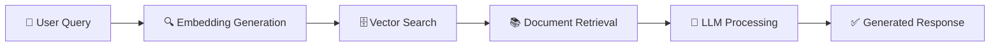

# 🏦 Loan RAG with LangChain

<div align="center">


**An intelligent loan information retrieval system powered by RAG (Retrieval Augmented Generation) and LangChain** 🤖

</div>

---

## 📋 Table of Contents

- [✨ Overview](#-overview)
- [🚀 Features](#-features)
- [🛠️ Tech Stack](#️-tech-stack)
- [📁 Project Structure](#-project-structure)
- [⚙️ Installation](#️-installation)
- [💻 Usage](#-usage)
- [🔧 Configuration](#-configuration)
- [📊 How It Works](#-how-it-works)
- [🤝 Contributing](#-contributing)
- [📄 License](#-license)
- [👤 Author](#-author)

---

## ✨ Overview

This project implements a **Retrieval Augmented Generation (RAG)** system specifically designed for loan-related queries. By combining the power of LangChain with vector databases, it provides accurate and context-aware responses to loan information requests.

🎯 **Perfect for:** Financial institutions, loan advisors, and anyone needing quick access to loan documentation and policies.

---

## 🚀 Features

✅ **Intelligent Query Processing** - Natural language understanding for loan-related questions

✅ **Document Retrieval** - Efficiently searches through loan documents and policies

✅ **Context-Aware Responses** - Provides accurate answers based on retrieved information

✅ **Vector Embeddings** - Uses state-of-the-art embeddings for semantic search

✅ **LangChain Integration** - Leverages LangChain's powerful chain capabilities

✅ **Scalable Architecture** - Designed to handle large document collections

---

## 🛠️ Tech Stack

| Technology | Purpose |
|------------|----------|
| 🐍 **Python** | Core programming language |
| 🦜 **LangChain** | Framework for LLM applications |
| 🔍 **Vector Database** | Efficient similarity search |
| 🤖 **OpenAI/HuggingFace** | LLM and embeddings |
| 📚 **Document Loaders** | Processing various document formats |
| 🧮 **FAISS/Chroma** | Vector storage and retrieval |

---

## 📁 Project Structure

```
Loan-Rag_Langchain/
│
├── 📂 data/                    # Loan documents and datasets
├── 📂 src/                     # Source code
│   ├── 🔧 rag_pipeline.py      # Main RAG implementation
│   ├── 🔧 embeddings.py        # Embedding generation
│   ├── 🔧 retriever.py         # Document retrieval logic
│   └── 🔧 utils.py             # Utility functions
│
├── 📂 notebooks/               # Jupyter notebooks for experimentation
├── 📂 config/                  # Configuration files
├── 📄 requirements.txt         # Python dependencies
└── 📄 README.md                # You are here!
```

---

## ⚙️ Installation

### Prerequisites

- Python 3.8 or higher 🐍
- pip package manager 📦
- Virtual environment (recommended) 🔒

### Steps

1️⃣ **Clone the repository**
```bash
git clone https://github.com/PriyanshuKanyal37/Loan-Rag_Langchain.git
cd Loan-Rag_Langchain
```

2️⃣ **Create a virtual environment**
```bash
python -m venv venv
source venv/bin/activate  # On Windows: venv\Scripts\activate
```

3️⃣ **Install dependencies**
```bash
pip install -r requirements.txt
```

4️⃣ **Set up environment variables**
```bash
cp .env.example .env
# Edit .env with your API keys
```

---

## 💻 Usage

### Quick Start

```python
from src.rag_pipeline import LoanRAG

# Initialize the RAG system
rag = LoanRAG()

# Load documents
rag.load_documents("data/loan_docs/")

# Ask a question
question = "What are the eligibility criteria for a home loan?"
response = rag.query(question)

print(f"Answer: {response}")
```

### Running the Application

```bash
python main.py
```

### Example Queries

💬 "What is the interest rate for personal loans?"

💬 "How long does loan approval take?"

💬 "What documents are required for a business loan?"

💬 "What are the repayment options available?"

---

## 🔧 Configuration

Edit the `config/config.yaml` file to customize:

- 🔑 **API Keys** - OpenAI, HuggingFace, etc.
- 📊 **Model Selection** - Choose your preferred LLM
- 🗄️ **Vector Database** - Configure storage options
- 🔍 **Retrieval Parameters** - Adjust search parameters
- 📝 **Prompt Templates** - Customize response generation

---

## 📊 How It Works



1. **Document Ingestion** 📥 - Load and process loan documents
2. **Embedding Creation** 🧮 - Convert text to vector representations
3. **Query Processing** 🔍 - Transform user questions into embeddings
4. **Similarity Search** 🎯 - Find relevant document chunks
5. **Response Generation** 💡 - Use LLM to synthesize answers

---

## 🤝 Contributing

Contributions are welcome! 🎉

1. 🍴 Fork the repository
2. 🌿 Create your feature branch (`git checkout -b feature/AmazingFeature`)
3. 💾 Commit your changes (`git commit -m 'Add some AmazingFeature'`)
4. 📤 Push to the branch (`git push origin feature/AmazingFeature`)
5. 🔀 Open a Pull Request

### Guidelines

- ✍️ Write clear commit messages
- 📝 Update documentation as needed
- ✅ Add tests for new features
- 🎨 Follow the existing code style

---

## 📄 License

This project is licensed under the **MIT License** - see the [LICENSE](LICENSE) file for details.

---

## 👤 Author

**Priyanshu Kanyal**

- 🐙 GitHub: [@PriyanshuKanyal37](https://github.com/PriyanshuKanyal37)
- 📧 Email: [Your Email]
- 💼 LinkedIn: [Your LinkedIn]

---

<div align="center">

### 🌟 Star this repo if you find it helpful!

**Made with ❤️ and 🤖**

[](https://github.com/PriyanshuKanyal37/Loan-Rag_Langchain/stargazers)
[](https://github.com/PriyanshuKanyal37/Loan-Rag_Langchain/network/members)

</div>

---

### 🚀 Quick Links

- [📖 Documentation](docs/)
- [🐛 Report Bug](https://github.com/PriyanshuKanyal37/Loan-Rag_Langchain/issues)
- [💡 Request Feature](https://github.com/PriyanshuKanyal37/Loan-Rag_Langchain/issues)
- [💬 Discussions](https://github.com/PriyanshuKanyal37/Loan-Rag_Langchain/discussions)

---

**Happy Coding! 🎉**
